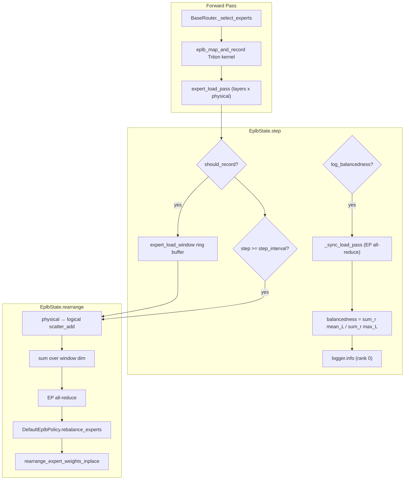

# EPLB Metrics Research Report

<!-- markdownlint-disable MD060 -->

**Repository:** vLLM (`vllm-project/vllm`)

**Branch / HEAD:** `main` @ `2659467497`

**Date:** 2026-07-23

This report traces how Expert Parallel Load Balancing (EPLB) collects load,
how the logged `balancedness` metric is computed on current `main`, and how
that differs from the load signal that actually drives expert rearrangement.

---

## 1. Executive Summary

EPLB maintains two distinct load concepts:

| Concept | Tensor | Role |
|---------|--------|------|
| **Observed load (per step)** | `expert_load_pass` | Raw token counts from routing atomics this engine step |
| **Aggregated load (for policy)** | `global_expert_load_window` | Sliding-window sum, mapped to logical experts, all-reduced across EP |
| **Balancedness (logging only)** | scalar `balancedness` | Diagnostic ratio from current pass; does **not** trigger rebalance |

**Key findings on current `main`:**

1. **Load unit** is top-k routing slot count (atomic +1 per assignment), not
   unique tokens. With `top_k > 1`, load scales with k.

2. **Logged balancedness** uses `expert_load_pass` after EP all-reduce. The
   code comment says "mean load across ranks / max load across ranks per layer,"
   but the implementation reduces across **layers** (`dim=0`), not ranks
   (`dim=-1`). Persistent rank skew can report `1.0`.

3. **Rebalancing** is time-triggered (`step_interval`), not threshold-triggered
   on balancedness. The policy receives windowed logical-expert token totals
   and runs a greedy DeepSeek EPLB packing algorithm.

4. **No Prometheus export** on `main`. Balancedness is log-only when
   `log_balancedness=True`. Upstream PRs propose raw per-layer/per-rank counters
   instead (see §8).

---

## 2. Terminology

From the module glossary in `vllm/distributed/eplb/eplb_state.py`:

- **Logical expert:** model expert index (e.g. 256 routed experts).
- **Physical expert:** a replica slot on a GPU; redundant experts add extra
  slots mapping to the same logical expert.
- **Load unit:** token count routed to an expert — implemented as one count per
  top-k routing assignment.

---

## 3. Load Collection Pipeline

### 3.1 Recording site

During MoE routing, after logical top-k selection, a Triton kernel maps
logical→physical (hash-based replica pick) and atomically increments
`expert_load_view[physical_id]` by 1 per valid (unpadded) top-k slot.

**File:** `vllm/model_executor/layers/fused_moe/router/base_router.py`

```python
# Replica selection: Knuth hash of token index
hashed = (token_idx * 2654435769) & 0xFFFFFFFF
replica_idx = hashed % replica_count

# Load recording
tl.atomic_add(out_ptr + safe_physical_id, 1, mask=valid)
```

Recording is gated by:

- `should_record_tensor` (shared bool, all layers)
- Unpadded tokens only (`num_unpadded_tokens`)
- Valid physical expert id

### 3.2 Per-step tensors

| Symbol | Shape | Description |
|--------|-------|-------------|
| `expert_load_pass` | `(num_moe_layers, num_physical_experts)` | Current forward pass counts |
| `expert_load_window` | `(window_size, num_moe_layers, num_physical_experts)` | Ring buffer of recent passes |
| `expert_load_view` | slice of `expert_load_pass` | Per-layer view wired into router |

### 3.3 Call path (each engine step)

```text
GPUModelRunner.execute_model
  ├─ eplb_state.prepare_forward(num_unpadded_tokens)
  ├─ model forward
  │    └─ BaseRouter._select_experts
  │         └─ eplb_map_to_physical_and_record (Triton)
  └─ eplb_step → EplbState.step
       ├─ [optional] log balancedness from expert_load_pass
       ├─ maybe copy pass → expert_load_window
       └─ if step_interval: rearrange()
```

**Hook:** `gpu_model_runner.py:3372–3385` passes
`log_stats=self.parallel_config.eplb_config.log_balancedness`.

### 3.4 Sparse recording

Recording is enabled only in the last `window_size` steps before the next
rearrangement (or next log tick if logging is on). Most steps skip GPU
recording via `_should_record_current_step()` (`eplb_state.py:660–680`).

First rearrange is early: counter starts at
`step_interval - step_interval // 4` (~25% into first interval).

---

## 4. Balancedness Metric (Logged)

### 4.1 Enable and cadence

| Config field | Default | Role |
|--------------|---------|------|
| `log_balancedness` | `False` | Enable balancedness logging |
| `log_balancedness_interval` | `1` | Log every N rearrangement steps |

Logging requires EP all-reduce of `expert_load_pass` (`_sync_load_pass`,
`eplb_state.py:974–982`), which adds communication overhead — why it is
off by default.

### 4.2 Implementation (current `main`)

**File:** `vllm/distributed/eplb/eplb_state.py:574–594`

```python
# expert_load_pass: (num_moe_layers, num_physical_experts)
num_tokens_per_rank = (
    expert_load_pass.reshape(
        expert_load_pass.shape[0], ep_group.size(), -1
    )
    .sum(dim=-1)   # sum experts on each rank
    .float()
)
# Shape: (num_moe_layers, num_ranks)

avg_tokens_tensor = num_tokens_per_rank.mean(dim=0).sum(dim=0)
max_tokens_tensor = num_tokens_per_rank.max(dim=0).values.sum(dim=0)
balancedness = avg_tokens / max_tokens if max_tokens > 0 else 0.0
```

Let `X[layer, rank]` = total tokens routed to rank `r` on layer `L`.

**What the code computes:**

```text
avg_tokens  = Σ_r  mean_L(X[layer, r])
max_tokens  = Σ_r  max_L(X[layer, r])
balancedness = avg_tokens / max_tokens
```

**What the comment claims** (`eplb_state.py:583–585`):

```text
for each layer:
  (mean load across ranks) / (max load across ranks)
```

That would be:

```text
balancedness_correct = mean_L( mean_r(X) / max_r(X) )
```

### 4.3 Dimensional defect

The implementation uses `mean(dim=0)` and `max(dim=0)`, which reduce across
**layers**, not ranks. It compares each rank's mean layer load with that
rank's busiest layer — not imbalance across ranks.

**Worked example:** 2 layers, 2 ranks; rank 1 always gets 2× load.

| | Rank 0 | Rank 1 |
|---|--------|--------|
| Layer 0 | 100 | 200 |
| Layer 1 | 100 | 200 |

- `mean(dim=0)` → `[100, 200]` for each rank
- `max(dim=0)` → `[100, 200]` for each rank
- `avg_tokens = 300`, `max_tokens = 300` → **balancedness = 1.0**

Actual per-layer balance:

- Layer 0: `150/200 = 0.75`
- Layer 1: `150/200 = 0.75`
- Correct average: **0.75**

The metric reports perfect balance when ranks are consistently skewed across
all layers.

### 4.4 Log format

EP rank 0 only:

```text
EPLB step: {step} for model {name}: avg_tokens={avg:.2f}, max_tokens={max},
balancedness={balancedness:.4f}, steps until the next rearrangement: {N}
```

Uses **current pass only** (`expert_load_pass`), not the sliding window.

### 4.5 Documentation mismatch

`docs/serving/expert_parallel_deployment.md:152` describes balancedness as
"avg tokens per expert ÷ max tokens per expert." The code aggregates by
**EP rank** (summing all local physical experts), not per expert.

---

## 5. Rebalance Control Signal (Not Balancedness)

### 5.1 Trigger

Rearrangement fires when `expert_rearrangement_step >= step_interval`
(default 3000 engine steps). **No balancedness threshold.**

### 5.2 Aggregation for policy

**File:** `vllm/distributed/eplb/eplb_state.py:754–781`

```python
# Scatter physical → logical, sum over window dimension
logical_expert_load_window.scatter_add_(...)
global_expert_load_window = logical_expert_load_window.sum(dim=0)
global_expert_load_windows = self._allreduce_list(...)
```

Output shape: `(num_moe_layers, num_logical_experts)` — summed token load
over the sliding window, global across EP ranks.

### 5.3 Policy algorithm

**File:** `vllm/distributed/eplb/policy/default.py`

Adapted from [DeepSeek EPLB](https://github.com/deepseek-ai/eplb). Three-step
hierarchical packing when `num_groups % num_nodes == 0`:

1. **Pack expert groups to nodes** — `balanced_packing(tokens_per_group, num_nodes)`
2. **Replicate within nodes** — `replicate_experts`: greedily add redundant
   slots to logical expert with max `weight / logcnt`
3. **Pack physical experts to GPUs** — effective load
   `tokens_per_phy = tokens_per_mlog / mlogcnt`; `balanced_packing(...)`

`balanced_packing` is a greedy "lightest bin" heuristic — approximate load
balance, not an explicit optimization loop or target balancedness score.

### 5.4 Async vs sync

| Mode | Config | Behavior |
|------|--------|----------|
| Async (default) | `use_async=True` | Background thread runs policy; layer-by-layer weight transfer |
| Sync | `use_async=False` | Blocking rearrange in `rearrange()` |

If async cycle in progress at interval boundary, rearrange is deferred until
transfer completes.

---

## 6. Configuration Reference

**File:** `vllm/config/parallel.py:56–113`

| Field | Default | Role |
|-------|---------|------|
| `window_size` | 1000 | Sliding window depth (engine steps) |
| `step_interval` | 3000 | Rearrange every N engine steps |
| `num_redundant_experts` | 0 | Extra global physical expert replicas |
| `log_balancedness` | `False` | Enable balancedness logging |
| `log_balancedness_interval` | 1 | Log every N steps |
| `use_async` | `True` | Non-blocking rearrange |
| `policy` | `"default"` | Rebalance policy |
| `communicator` | `None` (auto) | Weight transfer backend |

CLI:

```bash
--enable-eplb
--eplb-config '{"log_balancedness":true,"window_size":1000,"step_interval":3000}'
```

Note: `log_balancedness` affects `ParallelConfig.compute_hash()` and can fail
multi-DP startup if workers differ (`vllm/v1/engine/utils.py:1334–1348`).

---

## 7. Caveats and Gaps

### 7.1 Top-k vs unique tokens

Docstrings say "token count." The kernel counts each top-k assignment. With
`top_k > 1`, load scales with k.

### 7.2 DP double-counting

`expert_load_window` docstring (`eplb_state.py:165–171`): with naive all-to-all,
each DP rank may count the same token set, inflating totals by `dp_size`.
No automatic division in code. Relative expert proportions are preserved, so
EPLB placement is unaffected; absolute metrics need manual correction.

### 7.3 Sparse recording vs logged metric

Logged `expert_load_pass` reflects the current pass when logging fires, not
a window average. Recording itself is sparse (last `window_size` steps before
rearrange/log).

### 7.4 Test coverage

| Covered | Not covered |
|---------|-------------|
| Per-physical load from routing (`tests/kernels/moe/test_routing.py`) | Balancedness formula |
| Policy mapping shapes (`tests/distributed/test_eplb_algo.py`) | `_should_record_current_step` gating |
| Weight rearrange correctness | Log line format / values |
| V2 runner wiring (`tests/v1/worker/test_gpu_model_runner_v2_eplb.py`) | DP double-counting |

### 7.5 No Prometheus on `main`

No EPLB counters/gauges in `vllm/v1/metrics/` on current `main`. Balancedness
is log-only.

---

## 8. Upstream History and Proposals

| Item | State | Relevance |
|------|-------|-----------|
| [#18343](https://github.com/vllm-project/vllm/pull/18343) EPLB feature | Merged | Original balancedness logging, periodic rearrange |
| [#22167](https://github.com/vllm-project/vllm/pull/22167) Load statistics fix | Merged | Count all physical experts globally; DP caveat documented |
| [#29499](https://github.com/vllm-project/vllm/pull/29499) NumPy optimization | Merged | `log_balancedness_interval`, `preserve_intragpu_slots` |
| [#39178](https://github.com/vllm-project/vllm/pull/39178) Dimension fix + verbose logging | **Open / unmerged** | Fixes dim bug; per-layer `mean/max` then average |
| [#43715](https://github.com/vllm-project/vllm/pull/43715) Prometheus token routing | **Open** | Raw `vllm:eplb_tokens_per_rank_total{layer,rank}` counters |
| [#30696](https://github.com/vllm-project/vllm/issues/30696) Per-instance EPLB metrics RFC | Open | Avoid all-reduce; derive balancedness in PromQL |

**Proposed correct formula** (from #39178 and RFC #30696):

```text
mean_over_layers( mean_over_ranks(X) / max_over_ranks(X) )
```

Or expose raw per-layer/per-rank counts and compute in Grafana:

```promql
sum by (layer_idx, dst_ep_rank) (vllm:eplb_tokens_routed_to_ep_rank)
```

---

## 9. Data Flow Diagram



---

## 10. Local Changeset (`get-ep-balance-metrics`)

This branch adds an opt-in Prometheus export for **per-logical-expert**
routing counts at **engine-step** granularity. It answers a different question
from rank balancedness:

- Rank balancedness asks: *which EP rank received too much work?*
- This metric asks: *which logical experts were selected, in which layer, and
  how often?*

| Item | Detail |
|------|--------|
| Config | `EPLBConfig.prometheus_expert_load` (default `false`) |
| Metric | `vllm:eplb_tokens_routed_to_expert{layer_idx,logical_expert_id}` |
| Semantics | Gauge of top-k assignment counts this step; replica slots summed into logical IDs |
| Recording | Forced every step when enabled (bypasses sparse window gate) |
| Sync | No EP all-reduce; each DP rank reports its local view |
| Also | `vllm:eplb_rearrangements_total`, `vllm:eplb_rearrangement_seconds` |

### 10.1 How the feature reuses EPLB

The feature does not add another routing hook or retain every token's
`topk_ids`. It reuses data EPLB already produces:

1. The existing router kernel increments
   `expert_load_pass[layer, physical_expert]` for every valid top-k assignment.
2. Enabling `prometheus_expert_load` keeps that existing recording gate on for
   every engine step.
3. At the end of the step, before `expert_load_pass` is copied into the EPLB
   window and zeroed, `EplbState._compute_local_expert_load_stats()` snapshots
   it.
4. `physical_load_to_logical()` uses the existing
   `physical_to_logical_map` with `scatter_add_`. Counts from redundant
   physical replicas are therefore merged into one stable logical expert ID.
5. The resulting `(num_moe_layers, num_logical_experts)` tensor moves to CPU
   as an `EplbMetricsStats` list.
6. Existing output plumbing carries it through
   `ModelRunnerOutput → SchedulerStats → PrometheusStatLogger`.
7. `EplbProm` updates one gauge for every `(layer, logical expert)` pair.


Logical IDs are deliberate. Physical expert slots can move during EPLB
rearrangement and redundant slots can appear. A time series labeled with a
physical slot would change meaning after rearrangement. A logical expert label
continues to identify the model expert whose weights and router identity stay
the same.

### 10.2 What the metric emits

Example:

```text
vllm:eplb_tokens_routed_to_expert{
  model_name="deepseek-ai/DeepSeek-V3",
  engine="0",
  layer_idx="12",
  logical_expert_id="37"
} 184
```

This means that, in engine `0`'s most recently completed step, MoE layer 12
routed 184 valid **top-k assignment slots** to logical expert 37.

Important semantics:

- `184` is not necessarily 184 unique tokens. A token contributes once to
  every selected expert, so total counts scale with router top-k.
- Padded routing rows are excluded by the existing router kernel.
- If expert 37 has multiple physical replicas, their counts are summed.
- Experts with no assignments in the step are emitted as zero-valued gauges.
- Values are local to the reporting engine/DP rank. PromQL can sum engines to
  obtain a deployment-level view without putting an all-reduce on inference.
- Only the main model is exported when a separate MoE draft model also exists.

The gauge is updated after every engine step, but Prometheus still samples at
its configured scrape interval. If ten engine steps occur between scrapes,
Prometheus sees the latest of those ten values, not ten separate samples.
There is intentionally no `step_id` label: adding one would create an
unbounded time-series cardinality explosion. Configure a short scrape interval
when near-step-resolution history is required.

### 10.3 Enabling and inspecting it

The feature is off by default because it creates
`num_moe_layers × num_logical_experts × num_engines` time series and forces
EPLB load recording every step.

Enable it with:

```bash
vllm serve <model> \
  --enable-expert-parallel \
  --enable-eplb \
  --eplb-config.prometheus_expert_load true
```

Inspect the raw series:

```bash
curl -s http://localhost:8000/metrics \
  | grep '^vllm:eplb_tokens_routed_to_expert'
```

Useful PromQL:

```promql
# Deployment-wide per-step expert load. Sums local engine/DP views.
sum by (model_name, layer_idx, logical_expert_id) (
  vllm:eplb_tokens_routed_to_expert
)

# Ten hottest logical experts across all layers in the latest scrape.
topk(10,
  sum by (model_name, layer_idx, logical_expert_id) (
    vllm:eplb_tokens_routed_to_expert
  )
)

# Each expert's share of assignments within its layer.
sum by (model_name, layer_idx, logical_expert_id) (
  vllm:eplb_tokens_routed_to_expert
)
/
ignoring (logical_expert_id) group_left
sum by (model_name, layer_idx) (
  vllm:eplb_tokens_routed_to_expert
)
```

These expert metrics identify hot and cold experts. They do not by themselves
show which EP rank owns each physical replica at that instant. Use the existing
rank balancedness signal, or a rank-level routing metric such as the one
proposed by PR #43715, for rank bottleneck analysis.

### 10.4 Cost and operational trade-offs

- **GPU work:** the existing router atomic counters run every step instead of
  only near an EPLB window or balancedness log event.
- **CPU transfer:** one `layers × logical_experts` snapshot is copied per step.
- **Prometheus cardinality:** fixed but potentially large. For a model with
  `L` MoE layers, `E` logical experts, and `N` engines, the metric creates
  `L × E × N` active series.
- **No collective:** metric collection does not add an EP all-reduce. This
  avoids the communication cost of `log_balancedness`.
- **Opt-in isolation:** when the flag is false, no gauges are registered and
  the original sparse EPLB recording schedule remains unchanged.

## 11. Conclusions

1. **Balancedness on `main` is a log-only diagnostic** with a dimensional bug.
   It does not control rebalancing.

2. **Rebalancing uses windowed logical-expert token totals** and a greedy
   packing policy on a fixed schedule. No closed-form balancedness objective.

3. **The load unit is top-k assignment count**, not unique tokens. DP and
   top-k semantics affect absolute numbers but preserve relative expert
   proportions for placement.

4. **This branch exposes logical-expert step gauges** behind
   `prometheus_expert_load`. Rank-level alternatives remain in upstream PRs
   (#43715 / RFC #30696).

5. **Balancedness formula fix** remains proposed in PR #39178 (unmerged).

---

## 12. Key Source References

| Path | Symbols / Lines |
|------|-----------------|
| `vllm/distributed/eplb/eplb_state.py` | `EplbState.step`, `physical_load_to_logical`, `_compute_local_expert_load_stats` |
| `vllm/distributed/eplb/metrics.py` | `EplbProm` |
| `vllm/distributed/eplb/policy/default.py` | `balanced_packing`, `replicate_experts`, `rebalance_experts` |
| `vllm/model_executor/layers/fused_moe/router/base_router.py` | `eplb_map_to_physical_and_record` |
| `vllm/config/parallel.py` | `EPLBConfig.prometheus_expert_load` |
| `vllm/v1/worker/gpu_model_runner.py` | `eplb_step`, `ModelRunnerOutput.eplb_stats` |
| `docs/serving/expert_parallel_deployment.md` | EPLB config table |
